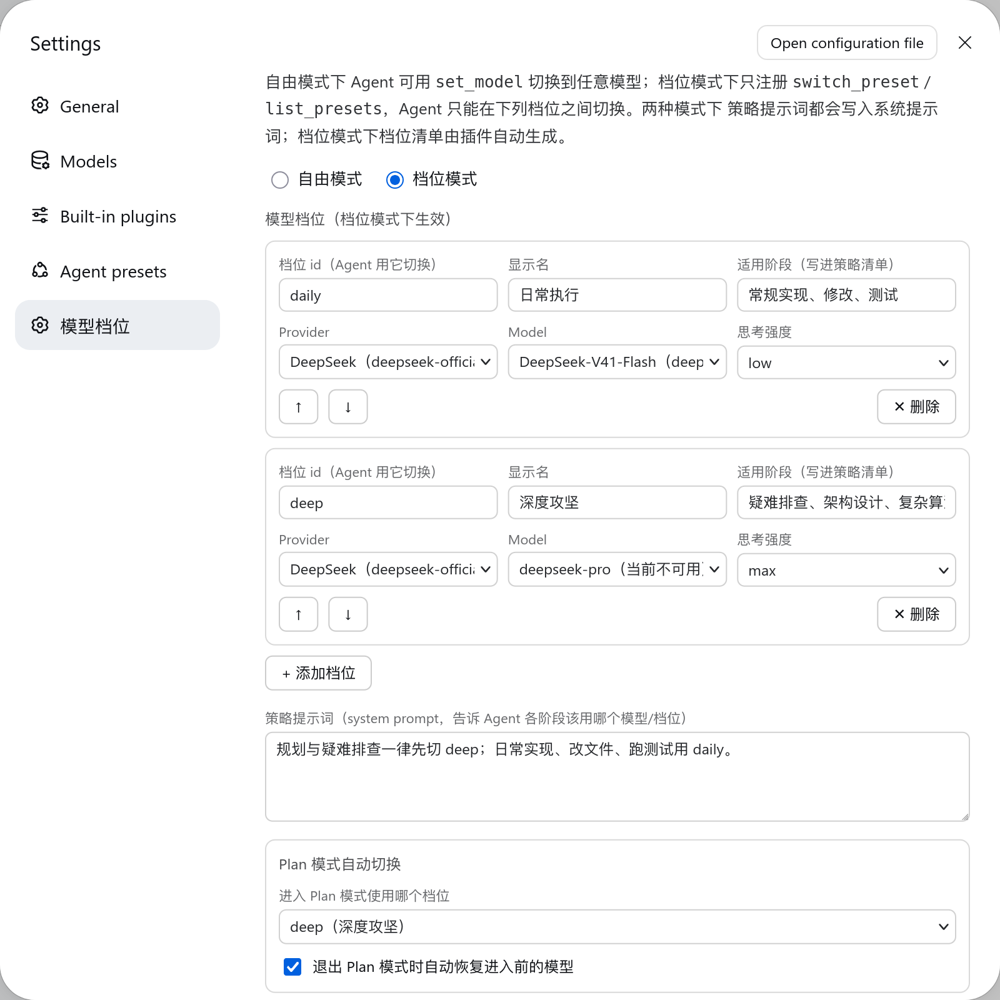

# dsh-set-model

<p align="center">
  <a href="./README.md"><strong>简体中文</strong></a> ·
  <a href="./README.en.md"><strong>English</strong></a>
</p>

A DeepSeek Harness (DSH / cordis) plugin for **model policy**: it turns "which model belongs to which task stage" into a deployment-declarable rule the agent actually follows.

- **Free mode** (default): the agent switches provider, model and reasoningEffort by task difficulty via `set_model` / `list_models`;
- **Preset mode**: the deployment declares a set of model presets (model + reasoning effort) and the agent may only switch between them (`switch_preset` / `list_presets`) — arbitrary model picking is off the table;
- Both modes accept a **policy prompt** that goes into the system prompt and tells the agent which preset each stage should use;
- The plugin injects the active model and preset into the runtime context, and switches models automatically alongside Plan Mode.

Switch to deep reasoning for hard problems, stay on the cost-effective tier for routine work — no manual configuration changes needed.



## Two modes

| | Free mode `mode: free` (default) | Preset mode `mode: preset` |
|---|---|---|
| Agent tools | `set_model`, `list_models` | `switch_preset`, `list_presets` |
| Switchable scope | any registered provider / model / reasoning effort | only the presets declared in `presets` |
| Plan Mode target | `planModel` | `planPreset` |
| Best for | a single developer picking models ad hoc | teams/deployments fixing a model vocabulary so the agent cannot wander |

> Preset mode constrains the **agent's tool surface**. Your own switching through the GUI model picker is unrestricted (DSH exposes no plugin hook to intercept user selections) and remains a manual fallback. Neither mode changes existing GUI behaviour.

## Model policy prompt

The `policyPrompt` setting is written into the system prompt as a `## Model policy` section (free mode writes that text alone; preset mode appends the generated preset roster):

```yaml
policyPrompt: |
  Always switch to deep for planning and hard debugging; use daily for routine work, edits and tests.
```

What the agent actually sees in preset mode (generated from each preset's `id`/`name`/`when` — nothing to hand-write):

```
## Model policy

Always switch to deep for planning and hard debugging; use daily for routine work, edits and tests.

本部署只允许在下列模型档位之间切换；进入对应阶段时调用 switch_preset 换档：

- **daily（日常执行）** — deepseek/deepseek-chat · reasoning low — 适用：常规实现、修改、测试
- **deep（深度攻坚）** — deepseek/deepseek-reasoner · reasoning max — 适用：疑难排查、架构设计
```

With nothing configured the section is empty and leaves no trace in the prompt.

## What the model sees

Via `systemPrompt.context`, the plugin appends one line with the current active model (and preset) to the tail of every step's Runtime Context snapshot (cache-safe append; the model can check itself at any time without calling a tool):

```
[Current active model: deepseek/deepseek-chat · reasoning: low · preset: daily]
```

While Plan Mode is active, a status marker is attached:

```
[Current active model: deepseek/deepseek-reasoner · reasoning: max · preset: deep] [Plan Mode Active]
```

`preset: xx` appears only when the active selection matches a declared preset.

## Tools

### set_model (free mode)

`set_model({ provider?, model?, reasoningEffort?, reason })` — `reason` is mandatory (every switch invalidates the session's KV cache, so the tool description requires the agent to justify the switch and avoid frequent changes):

```json
{ "model": "deepseek-reasoner", "reasoningEffort": "high", "reason": "Hard concurrency debugging, deep reasoning required" }
```

### list_models (free mode)

`list_models({ provider? })` lists registered providers and model capabilities (reasoning efforts, context window):

```
# Available Providers & Models:

## Provider: deepseek
- **deepseek-reasoner** (DeepSeek Reasoner) | Reasoning: [low, high, max] | Context: 128000
- **deepseek-chat** (DeepSeek Chat) | Context: 128000
```

### switch_preset (preset mode)

`switch_preset({ preset, reason })` — `preset` is a configured preset id, `reason` is mandatory; an unknown id returns the available presets:

```
Model preset switched to deep (深度攻坚) — deepseek/deepseek-reasoner · reasoning: max. Effective from the next step.
Reason: Hard concurrency debugging, deep reasoning required
```

### list_presets (preset mode)

`list_presets({})` lists the allowed presets, the stage each suits, and the one currently in use:

```
# Model presets

Mode: preset · Plan Mode active
Current: deepseek/deepseek-reasoner · reasoning max · preset deep

- **daily（日常执行）** — deepseek/deepseek-chat · reasoning low — 适用：常规实现、修改、测试
- **deep（深度攻坚）** — deepseek/deepseek-reasoner · reasoning max — 适用：疑难排查、架构设计 ← current
```

A switch takes effect from the next step: the plugin appends a `model/selection` event to the session (the same mechanism as the GUI model picker), and the Web UI state stays in sync.

## Plan Mode auto-transition

The plugin watches the plan projection state on `agent/pre-step` — zero manual intervention:

- **Entering Plan Mode** (`/plan on`): stashes the current model and switches automatically — to `planModel` in free mode, to the `planPreset` preset in preset mode;
- **Leaving Plan Mode** (`exit_plan_mode` approval / `/plan off`): automatically restores the pre-entry model (`autoRestorePlanModel`, on by default);
- A failed auto-switch only degrades to a warn and never interrupts the step.

## Safety guardrails

- **Provider whitelist**: when `allowedProviders` is non-empty, switching to providers outside the whitelist is rejected outright; in preset mode it also constrains the presets (a preset whose provider is not whitelisted is dropped at load with an error log);
- **Context-window guard**: if the current session's token pressure exceeds the target model's context window, the switch is rejected with a prompt to compact context first (e.g. clear_mind):

  ```
  Current session token pressure (70000 tokens) exceeds target model context window (65536 tokens).
  Please compact context (e.g. clear_mind) before switching to this model.
  ```

- **Route validation**: the candidate combination is validated by the DSH core via `ctx.llm.resolveCallConfig` (provider adapter exists, model is valid, reasoningEffort is supported); invalid combinations return a clear error and write no session state;
- **Configuration problems are not fatal**: duplicate preset ids, missing provider/model, a `planPreset` naming no preset, and similar issues are logged (`dsh-set-model: …`) and skipped — the plugin still loads, so a typo cannot take the whole plugin tree down;
- **Root agents only**: the tools are registered for root agents only (subagents get no self-switching tools); set `enableAgentTools: false` to disable them entirely.

## Settings page

The plugin ships a Web settings page ("模型档位", Settings → 模型档位) where you can maintain:

- the mode (free / preset);
- the preset table — add, remove and reorder rows; provider, model and reasoning effort are pickers fed by the live model catalog; plus `id`, display name and target stage;
- the policy prompt, the Plan target (preset or model), `autoRestorePlanModel`, `enableAgentTools` and `allowedProviders`.

Saving re-applies the plugin configuration on the host immediately, with no restart. Fields must be marked `volatile` to appear in the settings form (a DSH settings-system rule).

## Configuration

The settings namespace is the plugin's profile loader entry id: **`set-model`** (configurable in the Web Settings UI; changes take effect at runtime).

```yaml
# the profile's cordis.patch.yml (or the user layer the settings page writes)
- id: set-model
  name: dsh-set-model
  config:
    mode: preset                  # free (default) | preset
    presets:                      # required and non-empty in preset mode
      - id: daily                 # stable id the agent switches by
        name: 日常执行             # display name; falls back to the id
        when: 常规实现、修改、测试  # target stage; rendered into the policy prompt
        provider: deepseek
        model: deepseek-chat
        reasoningEffort: low      # off | low | high | max; defaults to the model default
      - id: deep
        name: 深度攻坚
        when: 疑难排查、架构设计
        provider: deepseek
        model: deepseek-reasoner
        reasoningEffort: max
    policyPrompt: |               # optional extra policy text (both modes)
      Always switch to deep first for production incidents.
    planPreset: deep              # preset mode: preset activated on entering Plan Mode
    planModel:                    # free mode: model activated on entering Plan Mode
      provider: deepseek
      model: deepseek-reasoner
      reasoningEffort: high
    autoRestorePlanModel: true    # restore on leaving Plan Mode (default true)
    enableAgentTools: true        # whether to register the model tools (default true)
    allowedProviders: []          # optional: whitelist of switchable providers (empty = unrestricted)
```

## Install

```bash
dsh plugin --profile web add dsh-set-model
```

No manual configuration needed after install — the bundled `cordis.patch.yml` mounts automatically.

Install straight from GitHub (source install; pnpm ≥10 requires allowing the build script):

```bash
dsh plugin --profile web add github:john-walks-slow/dsh-set-model
# The first add is blocked by pnpm: add the package name pnpm prints to
# allowBuilds in ~/.dsh/profiles/web/pnpm-workspace.yaml, then re-run
```

## Permissions & compatibility

- **No direct side effects**: no external services, no network requests from the plugin itself (model routing and capability queries all go through the DSH core `llm` service), no direct filesystem writes; it only appends a `model/selection` event via the session event API (persisted by the DSH session system) and injects one Runtime Context line plus one system prompt section
- **Browser half**: the settings page registers a `settings.section` from `lib/client.js` (a build artifact) and only calls DSH's `remote.settings` / `remote.session` RPCs — no network requests of its own
- **Host version requirement**: DSH `^0.1.7-rc.2 || ^0.2.0-rc.1` (on 0.1.2–0.1.6 the installer reports an explicit plugin/dsh version incompatibility; upgrade DSH)
- **Dependency declaration**: every DSH runtime package (`cordis`, `dsh-agent`, `dsh-llm`, `dsh-session`, `dsh-tools`, plus optional `dsh-settings`) is declared as a `peerDependency`, so the DSH module resolver routes the plugin's `@deepseek-ai/*` imports to the **host-provided copies** — the plugin never ships or hoists its own copies of them; the only runtime dependency is the leaf schema library `@deepseek-ai/schemastery` (`react` / `esbuild` / `@types/react` build the browser half only; React is provided by the web shell at runtime). Node ≥ 22.5
- **Failure degradation**: a failed Plan Mode auto-switch only warns and never breaks the step; tool validation failures return a clear error to the agent without polluting session state; a failed settings-page mount only logs to the console and never takes the GUI down

## Local development

```bash
npm install
npm run check     # tsc(host) + tsc(browser half)
npm test          # tsc(incl. test) + node --test dist/test/*.test.js
npm run build     # tsc → dist/src, esbuild → lib/client.js
npm run build:client   # rebuild the browser half only
```

For GUI verification, use a minimal dsh-e2e instance (see `scripts/dev-worktree.sh`):

```bash
dsh-e2e start --wait-ready --patch e2e/fixture/cordis.patch.yml
dsh-e2e run e2e/verify-policy-page.mjs
```

The e2e seed config lives in `e2e/fixture/cordis.patch.yml` and is injected with `--patch`; override the playwright / camoufox paths with `DSH_E2E_PLAYWRIGHT` / `DSH_E2E_BROWSER`.

After changing the browser half, always rebuild `lib/client.js`; the build script already runs `node --check lib/client.js`.

## License

MIT

## Release a new version

One command runs tests, bumps the version and packs (`npm version` also commits and tags):

```bash
npm run release        # patch; for bigger changes: npm version minor or major
```

Then publish with the fingerprint flow and push:

```bash
node ~/.agents/skills/npm-publish/scripts/publish-webauthn.cjs /tmp/dsh-set-model-<newver>.tgz
git push --follow-tags
```

Verify with `npm view dsh-set-model version`. When releasing several packages, check "do not challenge for the next 5 minutes" on the webauthn page to publish them all with one fingerprint.
